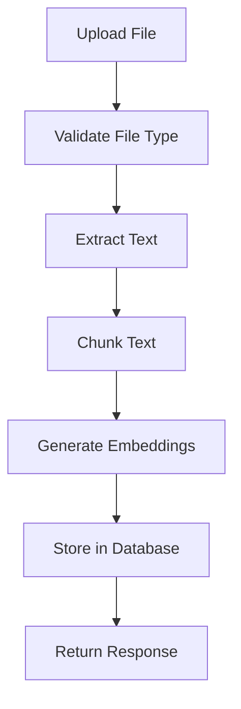

# Admin Operations

The admin routes (`/admin/*`) handle document management and processing operations for the RAG system.

## Overview

All admin endpoints are prefixed with `/admin` and handle:

- Document upload and text extraction
- Text chunking and embedding generation
- Document listing and retrieval
- Document deletion with cascade cleanup

## Admin Router

From `src/routes/admin.py:17`:

```python
router = APIRouter(prefix="/admin", tags=["admin"])
```

All routes in this router are automatically prefixed with `/admin`.

## Document Processing Pipeline

When a document is uploaded via `POST /admin/documents`, it goes through this pipeline:



### Step-by-Step Process

<Steps>
  <Step title="File Upload">
    User uploads file via multipart form data.
    
    ```python
    file: UploadFile = File(...)
    file_content = await file.read()
    ```
  </Step>

  <Step title="File Type Validation">
    System checks file type against supported formats.
    
    ```python
    FILE_HANDLERS = [
        {
            "mime_types": {"application/pdf"},
            "extensions": {".pdf"},
            "handler": extract_text_from_pdf,
        },
        {
            "mime_types": {"text/plain", "text/markdown"},
            "extensions": {".txt", ".md"},
            "handler": extract_text_from_plain,
        },
    ]
    ```
    
    Checks both MIME type and file extension for flexibility.
  </Step>

  <Step title="Text Extraction">
    Extract text based on file type.
    
    **PDF Files** (`src/routes/admin.py:50`):
    ```python
    def extract_text_from_pdf(file_content: bytes) -> str:
        pdf = PdfReader(io.BytesIO(file_content))
        text = ""
        for page in pdf.pages:
            text += page.extract_text() or ""
        return text
    ```
    
    **Text/Markdown Files** (`src/routes/admin.py:59`):
    ```python
    def extract_text_from_plain(file_content: bytes) -> str:
        return file_content.decode("utf-8")
    ```
  </Step>

  <Step title="Create Document Record">
    Store document metadata in database.
    
    ```python
    document = Document(
        filename=file.filename or "unknown",
        content_type=file.content_type,
        file_size=file_size,
    )
    db.add(document)
    await db.flush()  # Get document.id
    ```
    
    `flush()` assigns the UUID without committing the transaction.
  </Step>

  <Step title="Chunk Text">
    Split text into overlapping chunks.
    
    ```python
    chunks = chunk_text(text)  # 1000 chars, 200 overlap
    ```
    
    See [Chunking Strategy](/api/documents#chunking-strategy) for details.
  </Step>

  <Step title="Generate Embeddings">
    Create vector embeddings for all chunks.
    
    ```python
    embeddings = generate_embeddings(chunks)
    # Batch processes all chunks at once
    # Uses all-MiniLM-L6-v2 model
    # Returns 384-dimensional vectors
    ```
  </Step>

  <Step title="Store Chunks">
    Save all chunks with embeddings to database.
    
    ```python
    chunk_records = []
    for idx, (chunk_text_content, embedding) in enumerate(zip(chunks, embeddings)):
        chunk = Chunk(
            document_id=document.id,
            content=chunk_text_content,
            embedding=embedding,
            chunk_index=idx,
        )
        chunk_records.append(chunk)
    
    db.add_all(chunk_records)
    await db.commit()
    ```
    
    All chunks committed in a single transaction for atomicity.
  </Step>

  <Step title="Return Response">
    Send success response with document details.
    
    ```python
    return UploadResponse(
        message="Document uploaded and processed successfully",
        document=DocumentResponse(...),
        chunks_created=len(chunks),
    )
    ```
  </Step>
</Steps>

## Chunk Management

### Chunk Structure

From `src/database.py:49`:

```python
class Chunk(Base):
    """Stores document chunks with vector embeddings."""
    
    __tablename__ = "chunks"
    
    id: Mapped[UUID] = mapped_column(primary_key=True, default=uuid4)
    document_id: Mapped[UUID] = mapped_column(
        ForeignKey("documents.id", ondelete="CASCADE")
    )
    content: Mapped[str] = mapped_column(Text, nullable=False)
    embedding = mapped_column(Vector(384))  # 384 dimensions
    chunk_index: Mapped[int | None] = mapped_column(Integer)
    created_at: Mapped[datetime] = mapped_column(
        DateTime, server_default=func.now()
    )
    
    document: Mapped["Document"] = relationship(
        "Document", back_populates="chunks"
    )
```

### Key Fields

<ParamField path="id" type="UUID">
  Primary key for the chunk
</ParamField>

<ParamField path="document_id" type="UUID">
  Foreign key to parent document with CASCADE delete
</ParamField>

<ParamField path="content" type="TEXT">
  The text content of the chunk (up to ~1000 characters)
</ParamField>

<ParamField path="embedding" type="VECTOR(384)">
  pgvector column storing 384-dimensional embedding
</ParamField>

<ParamField path="chunk_index" type="INTEGER">
  Position of chunk in original document (0-based)
</ParamField>

<ParamField path="created_at" type="TIMESTAMP">
  Timestamp when chunk was created
</ParamField>

### Cascade Deletion

Chunks are automatically deleted when their parent document is deleted:

```python
# In Document model
chunks: Mapped[List["Chunk"]] = relationship(
    "Chunk", 
    back_populates="document", 
    cascade="all, delete-orphan"
)

# In Chunk model
document_id: Mapped[UUID] = mapped_column(
    ForeignKey("documents.id", ondelete="CASCADE")
)
```

When you delete a document, PostgreSQL automatically deletes all associated chunks.

## Document Listing

### Query with Chunk Counts

From `src/routes/admin.py:165`:

```python
stmt = (
    select(
        Document,
        func.count(Chunk.id).label("chunk_count")
    )
    .outerjoin(Chunk)  # LEFT OUTER JOIN
    .group_by(Document.id)
    .order_by(Document.created_at.desc())  # Newest first
)

result = await db.execute(stmt)
rows = result.all()
```

**SQL equivalent**:

```sql
SELECT 
    documents.*,
    COUNT(chunks.id) as chunk_count
FROM documents
LEFT OUTER JOIN chunks ON documents.id = chunks.document_id
GROUP BY documents.id
ORDER BY documents.created_at DESC
```

Uses `outerjoin` to include documents even if they have no chunks (though this shouldn't happen in normal operation).

## Error Handling

The admin routes handle various error conditions:

### Unsupported File Type

```python
raise HTTPException(
    status_code=400,
    detail=f"Unsupported file type: {content_type}. Supported: PDF, TXT, MD",
)
```

### Empty File

```python
if not text.strip():
    raise HTTPException(
        status_code=400, 
        detail="Could not extract any text from the file"
    )
```

### Document Not Found

```python
if not row:
    raise HTTPException(status_code=404, detail="Document not found")
```

## Response Models

All response models use Pydantic for validation:

### DocumentResponse

```python
class DocumentResponse(BaseModel):
    id: UUID
    filename: str
    content_type: Optional[str]
    file_size: Optional[int]
    created_at: datetime
    chunk_count: Optional[int] = None
    
    class Config:
        from_attributes = True  # For SQLAlchemy models
```

### UploadResponse

```python
class UploadResponse(BaseModel):
    message: str
    document: DocumentResponse
    chunks_created: int
```

### DocumentListResponse

```python
class DocumentListResponse(BaseModel):
    documents: List[DocumentResponse]
    total: int
```

### DeleteResponse

```python
class DeleteResponse(BaseModel):
    message: str
    document_id: UUID
    chunks_deleted: int
```

## File Type Detection

The system uses a flexible file type detection approach:

```python
def extract_text_from_file(
    file_content: bytes, 
    content_type: str, 
    filename: str
) -> str:
    """Extract text from uploaded file based on type."""
    for handler_config in FILE_HANDLERS:
        if content_type in handler_config["mime_types"] or any(
            filename.endswith(ext) for ext in handler_config["extensions"]
        ):
            return handler_config["handler"](file_content)
    
    raise HTTPException(...)
```

**Checks both**:
1. MIME type from HTTP header (`content_type`)
2. File extension from filename

This handles cases where:
- Browser sends wrong MIME type
- File has no MIME type
- Custom or unusual file naming

## Transaction Management

The upload operation uses a single database transaction:

```python
# 1. Add document
db.add(document)
await db.flush()  # Get ID without committing

# 2. Process text and generate embeddings (no DB operations)
chunks = chunk_text(text)
embeddings = generate_embeddings(chunks)

# 3. Add all chunks
db.add_all(chunk_records)

# 4. Commit everything atomically
await db.commit()
```

**Benefits**:
- If embedding generation fails, nothing is saved
- All-or-nothing: document and chunks saved together
- Database consistency guaranteed

## Performance Considerations

### Batch Processing

```python
# Generate embeddings for all chunks at once
embeddings = generate_embeddings(chunks)  # Batch

# NOT:
# for chunk in chunks:
#     embedding = generate_embedding(chunk)  # Slow!
```

Batch processing is ~10x faster for multiple chunks.

### Database Efficiency

```python
# Add all chunks in single operation
db.add_all(chunk_records)
await db.commit()

# NOT:
# for chunk in chunk_records:
#     db.add(chunk)
#     await db.commit()  # Slow!
```

Single commit is much faster than multiple commits.

### Text Extraction

For large PDFs, text extraction can be slow. Consider:

- Using async task queue (Celery, RQ) for background processing
- Implementing progress callbacks for user feedback
- Caching extracted text

## Security Considerations

<Warning>
  The current implementation has no authentication. In production, you should:
  
  - Add authentication middleware
  - Require API keys or OAuth tokens
  - Implement rate limiting
  - Validate file sizes
  - Scan uploads for malware
</Warning>

### Recommended Security Additions

<AccordionGroup>
  <Accordion title="Authentication">
    Add API key or JWT authentication:
    
    ```python
    from fastapi import Security, HTTPException
    from fastapi.security import APIKeyHeader
    
    api_key_header = APIKeyHeader(name="X-API-Key")
    
    async def verify_api_key(api_key: str = Security(api_key_header)):
        if api_key != settings.admin_api_key:
            raise HTTPException(status_code=403, detail="Invalid API key")
    
    @router.post("/documents", dependencies=[Depends(verify_api_key)])
    async def upload_document(...):
        ...
    ```
  </Accordion>
  
  <Accordion title="Rate Limiting">
    Limit upload frequency:
    
    ```python
    from slowapi import Limiter
    from slowapi.util import get_remote_address
    
    limiter = Limiter(key_func=get_remote_address)
    
    @router.post("/documents")
    @limiter.limit("10/hour")
    async def upload_document(...):
        ...
    ```
  </Accordion>
  
  <Accordion title="File Size Limits">
    Enforce maximum file size:
    
    ```python
    MAX_FILE_SIZE = 10 * 1024 * 1024  # 10 MB
    
    if file_size > MAX_FILE_SIZE:
        raise HTTPException(
            status_code=400,
            detail=f"File too large. Max size: {MAX_FILE_SIZE} bytes"
        )
    ```
  </Accordion>
  
  <Accordion title="File Validation">
    Validate file content matches extension:
    
    ```python
    import magic
    
    mime = magic.from_buffer(file_content, mime=True)
    if mime not in ALLOWED_MIMES:
        raise HTTPException(status_code=400, detail="Invalid file type")
    ```
  </Accordion>
</AccordionGroup>

## API Documentation

FastAPI automatically generates interactive documentation:

- **Swagger UI**: `http://localhost:8000/docs`
- **ReDoc**: `http://localhost:8000/redoc`

The admin routes are grouped under the "admin" tag in the documentation.

## Implementation Reference

Key files:

- `src/routes/admin.py` - All admin route handlers
- `src/database.py:30` - Document model
- `src/database.py:49` - Chunk model
- `src/embeddings.py:32` - chunk_text()
- `src/embeddings.py:25` - generate_embeddings()

## Next Steps

<CardGroup cols={2}>
  <Card title="Document Endpoints" icon="file" href="/api/documents">
    Detailed documentation for each endpoint
  </Card>
  <Card title="Architecture" icon="diagram-project" href="/api/architecture">
    System architecture overview
  </Card>
  <Card title="Embeddings" icon="vector-square" href="/api/embeddings">
    Deep dive into embedding generation
  </Card>
</CardGroup>
