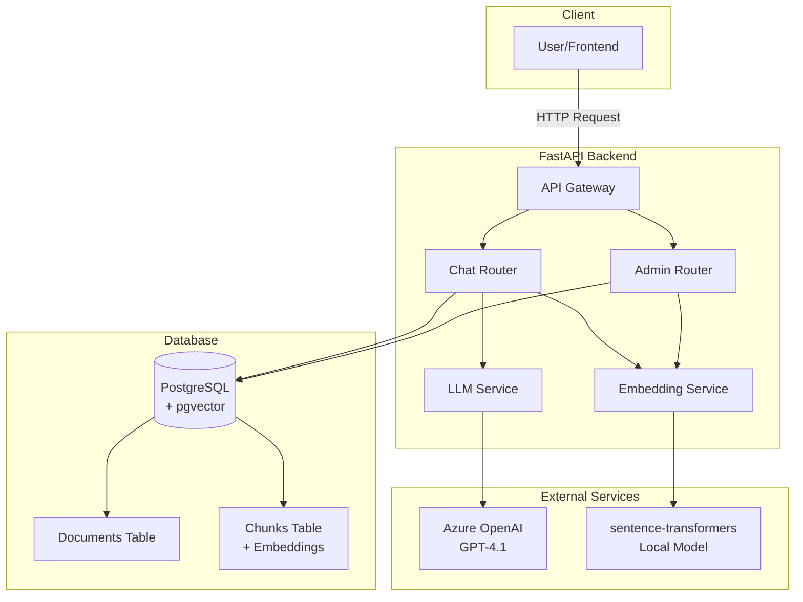

# System Architecture

Understand the technical architecture, data flow, and design decisions behind the Pranav AI RAG chatbot.

## High-Level Architecture



## Core Components

### 1. FastAPI Application

**File**: `main.py`

The main application entry point:

```python
app = FastAPI(
    title="Pranav AI",
    description="RAG-powered chatbot backend for portfolio",
    version="1.0.0",
    lifespan=lifespan,
)

# CORS middleware
app.add_middleware(
    CORSMiddleware,
    allow_origins=["*"],
    allow_credentials=True,
    allow_methods=["*"],
    allow_headers=["*"],
)

# Include routers
app.include_router(admin_router)  # /admin/*
app.include_router(chat_router)   # /chat
```

**Features**:
- ASGI async server (Uvicorn)
- Automatic OpenAPI documentation
- CORS support for frontend integration
- Lifespan events for startup/shutdown

### 2. Database Layer

**File**: `src/database.py`

#### Database Schema

<Tabs>
  <Tab title="Documents Table">
    ```sql
    CREATE TABLE documents (
        id UUID PRIMARY KEY DEFAULT uuid_generate_v4(),
        filename VARCHAR(255) NOT NULL,
        content_type VARCHAR(100),
        file_size INTEGER,
        created_at TIMESTAMP DEFAULT NOW()
    );
    ```
    
    Stores metadata for uploaded documents.
  </Tab>
  
  <Tab title="Chunks Table">
    ```sql
    CREATE TABLE chunks (
        id UUID PRIMARY KEY DEFAULT uuid_generate_v4(),
        document_id UUID NOT NULL REFERENCES documents(id) ON DELETE CASCADE,
        content TEXT NOT NULL,
        embedding VECTOR(384),
        chunk_index INTEGER,
        created_at TIMESTAMP DEFAULT NOW()
    );
    
    -- Index for fast vector similarity search
    CREATE INDEX ON chunks USING ivfflat (embedding vector_cosine_ops);
    ```
    
    Stores text chunks with 384-dimensional embeddings.
  </Tab>
</Tabs>

#### Async Database Connection

```python
# Convert to async URL
database_url = settings.database_url.replace(
    "postgresql://", 
    "postgresql+asyncpg://"
)

# Create async engine
engine = create_async_engine(database_url, echo=settings.debug)
async_session = async_sessionmaker(
    engine, 
    class_=AsyncSession, 
    expire_on_commit=False
)

# Dependency injection
async def get_db():
    async with async_session() as session:
        try:
            yield session
        finally:
            await session.close()
```

### 3. Embedding Service

**File**: `src/embeddings.py`

#### Model Loading

```python
@lru_cache()
def get_embedding_model() -> SentenceTransformer:
    """Get cached embedding model instance."""
    return SentenceTransformer(settings.embedding_model)
```

The model is:
- Loaded once and cached
- **all-MiniLM-L6-v2**: Fast, compact (80MB)
- **384 dimensions**: Efficient vector size
- **Free**: No API costs, runs locally

#### Embedding Generation

<CodeGroup>
```python Single Text
def generate_embedding(text: str) -> List[float]:
    model = get_embedding_model()
    embedding = model.encode(text, convert_to_numpy=True)
    return embedding.tolist()
```

```python Batch Processing
def generate_embeddings(texts: List[str]) -> List[List[float]]:
    model = get_embedding_model()
    embeddings = model.encode(
        texts, 
        convert_to_numpy=True, 
        show_progress_bar=True
    )
    return embeddings.tolist()
```
</CodeGroup>

### 4. LLM Service

**File**: `src/llm.py`

#### Azure OpenAI Client

```python
@lru_cache()
def get_llm_client() -> AsyncAzureOpenAI:
    return AsyncAzureOpenAI(
        api_key=settings.azure_openai_api_key,
        api_version=settings.azure_openai_api_version,
        azure_endpoint=settings.azure_openai_endpoint,
    )
```

#### System Prompt

```python
SYSTEM_PROMPT = """You are Pranav AI, a helpful assistant that answers 
questions about Pranav based on the provided context.

**Rules:**
- Answer questions based ONLY on the provided context
- If the context doesn't contain relevant information, say "I don't have 
  information about that in my knowledge base"
- Be concise and direct in your responses
- Use a friendly, professional tone
- When information comes from different documents, clearly distinguish and 
  attribute information to each source
- Always mention which document the information came from when relevant

**Context:**
{context}
"""
```

#### Response Generation

```python
async def generate_response(
    query: str,
    context: str,
    chat_history: Optional[List[dict]] = None,
) -> str:
    client = get_llm_client()
    
    messages = [
        {"role": "system", "content": SYSTEM_PROMPT.format(context=context)}
    ]
    
    # Add last 5 messages from history
    if chat_history:
        for msg in chat_history[-5:]:
            messages.append(msg)
    
    # Add current query
    messages.append({"role": "user", "content": query})
    
    response = await client.chat.completions.create(
        model=settings.azure_deployment_name,
        messages=messages,
        temperature=0.7,
        max_tokens=1000,
    )
    
    return response.choices[0].message.content
```

## Data Flow

### Document Upload Flow

<Steps>
  <Step title="Client uploads file">
    ```bash
    POST /admin/documents
    Content-Type: multipart/form-data
    ```
  </Step>
  
  <Step title="Text extraction">
    - PDF: pypdf extracts text from pages
    - TXT/MD: UTF-8 decoding
  </Step>
  
  <Step title="Document stored">
    ```sql
    INSERT INTO documents (filename, content_type, file_size)
    VALUES ('resume.pdf', 'application/pdf', 245632);
    ```
  </Step>
  
  <Step title="Text chunking">
    Split text into 1000-char chunks with 200-char overlap
  </Step>
  
  <Step title="Embedding generation">
    ```python
    embeddings = generate_embeddings(chunks)
    # Batch process all chunks at once
    # Returns List[List[float]] with 384 dimensions
    ```
  </Step>
  
  <Step title="Chunks stored">
    ```sql
    INSERT INTO chunks (document_id, content, embedding, chunk_index)
    VALUES 
      ('doc-uuid', 'chunk 1 text', '[0.1,0.2,...]', 0),
      ('doc-uuid', 'chunk 2 text', '[0.3,0.4,...]', 1),
      ...
    ```
  </Step>
  
  <Step title="Response sent">
    ```json
    {
      "message": "Document uploaded and processed successfully",
      "chunks_created": 12
    }
    ```
  </Step>
</Steps>

### Chat Query Flow

<Steps>
  <Step title="User sends message">
    ```json
    POST /chat
    {
      "message": "What are Pranav's skills?"
    }
    ```
  </Step>
  
  <Step title="Query embedding">
    ```python
    query_embedding = generate_embedding(request.message)
    # Returns 384-dimensional vector
    ```
  </Step>
  
  <Step title="Vector similarity search">
    ```sql
    SELECT 
        c.content,
        d.filename,
        1 - (c.embedding <=> '[query_embedding]'::vector) as similarity
    FROM chunks c
    JOIN documents d ON c.document_id = d.id
    ORDER BY c.embedding <=> '[query_embedding]'::vector
    LIMIT 5
    ```
    
    Uses pgvector's cosine similarity operator `<=>`
  </Step>
  
  <Step title="Filter relevant chunks">
    ```python
    if similarity > 0.3:  # Only include relevant results
        context_parts.append(f"[From: {filename}]\n{content}")
    ```
  </Step>
  
  <Step title="Build context">
    ```python
    context = "\n\n---\n\n".join(context_parts)
    # Combines all relevant chunks with source attribution
    ```
  </Step>
  
  <Step title="LLM generation">
    ```python
    response = await generate_response(
        query=request.message,
        context=context,
        chat_history=chat_history
    )
    # Calls Azure OpenAI GPT-4.1
    ```
  </Step>
  
  <Step title="Response with sources">
    ```json
    {
      "response": "Pranav is proficient in Python, Go, and JavaScript...",
      "sources": [
        {
          "document_name": "resume.pdf",
          "content": "Programming Languages: Python...",
          "similarity": 0.892
        }
      ]
    }
    ```
  </Step>
</Steps>

## Vector Similarity Search

### Cosine Similarity

pgvector uses cosine similarity to find relevant chunks:

```
similarity = 1 - cosine_distance
cosine_distance = embedding1 <=> embedding2
```

**Range**: 0 to 1
- **1.0**: Identical vectors (perfect match)
- **0.5**: Somewhat similar
- **0.0**: Completely different

**Threshold**: Only chunks with similarity > 0.3 are used

### Vector Indexing

For large datasets, create an IVFFlat index:

```sql
CREATE INDEX ON chunks 
USING ivfflat (embedding vector_cosine_ops)
WITH (lists = 100);
```

**Benefits**:
- Much faster search (approximate nearest neighbors)
- Scales to millions of vectors
- Configurable speed/accuracy tradeoff

**Tradeoff**:
- Slightly less accurate than exact search
- Requires periodic index rebuilding

## Configuration Management

**File**: `src/config.py`

Using Pydantic Settings:

```python
class Settings(BaseSettings):
    # Azure OpenAI
    azure_openai_endpoint: str
    azure_openai_api_key: str
    azure_openai_api_version: str = "2024-02-15-preview"
    azure_deployment_name: str = "gpt-4.1"
    
    # Database
    database_url: str
    
    # Embeddings
    embedding_model: str = "all-MiniLM-L6-v2"
    embedding_dimension: int = 384
    
    # App
    debug: bool = False
    
    class Config:
        env_file = ".env"

@lru_cache()
def get_settings() -> Settings:
    return Settings()
```

**Benefits**:
- Type checking and validation
- Automatic .env loading
- Default values
- Cached for performance

## Error Handling

### HTTP Exceptions

```python
from fastapi import HTTPException

raise HTTPException(
    status_code=400,
    detail="Unsupported file type"
)
```

FastAPI automatically converts to JSON:

```json
{
  "detail": "Unsupported file type"
}
```

### Database Errors

SQLAlchemy errors are caught and handled:

```python
try:
    await db.commit()
except Exception as e:
    await db.rollback()
    raise HTTPException(status_code=500, detail=str(e))
```

### Azure OpenAI Errors

Handled by OpenAI SDK:

```python
from openai import APIError, RateLimitError

try:
    response = await client.chat.completions.create(...)
except RateLimitError:
    raise HTTPException(status_code=429, detail="Rate limit exceeded")
except APIError as e:
    raise HTTPException(status_code=502, detail=str(e))
```

## Performance Optimization

### Async/Await

All I/O operations are async:

```python
# Database
async with async_session() as session:
    result = await session.execute(query)

# LLM
response = await client.chat.completions.create(...)

# File I/O
file_content = await file.read()
```

Benefits:
- Non-blocking I/O
- Handle multiple requests concurrently
- Better resource utilization

### Caching

Using `@lru_cache()` for expensive operations:

```python
@lru_cache()
def get_settings() -> Settings:
    return Settings()  # Loaded once

@lru_cache()
def get_embedding_model() -> SentenceTransformer:
    return SentenceTransformer(...)  # Loaded once

@lru_cache()
def get_llm_client() -> AsyncAzureOpenAI:
    return AsyncAzureOpenAI(...)  # Created once
```

### Batch Processing

```python
# Good: Batch embedding generation
embeddings = generate_embeddings(chunks)

# Bad: One at a time
for chunk in chunks:
    embedding = generate_embedding(chunk)
```

Batch processing is ~10x faster.

### Database Transactions

```python
# Good: Single transaction
db.add(document)
db.add_all(chunk_records)
await db.commit()

# Bad: Multiple commits
db.add(document)
await db.commit()
for chunk in chunk_records:
    db.add(chunk)
    await db.commit()
```

Single commit is much faster.

## Scalability Considerations

<AccordionGroup>
  <Accordion title="Horizontal Scaling">
    Deploy multiple API instances behind a load balancer:
    
    ```bash
    # Instance 1
    uvicorn main:app --host 0.0.0.0 --port 8000
    
    # Instance 2
    uvicorn main:app --host 0.0.0.0 --port 8001
    
    # Load balancer (nginx, etc.)
    upstream backend {
        server localhost:8000;
        server localhost:8001;
    }
    ```
    
    All instances share the same PostgreSQL database.
  </Accordion>
  
  <Accordion title="Database Scaling">
    For large datasets:
    
    - **Read replicas**: Scale read-heavy operations
    - **Connection pooling**: pgbouncer for connection management
    - **Partitioning**: Partition chunks table by document_id
    - **Indexing**: Create pgvector indexes for fast search
  </Accordion>
  
  <Accordion title="Caching Layer">
    Add Redis for caching:
    
    - Cache common queries and responses
    - Cache embeddings for frequent queries
    - Session storage for chat history
  </Accordion>
  
  <Accordion title="Background Processing">
    Use task queue for heavy operations:
    
    ```python
    # Celery task
    @celery.task
    def process_document(document_id: str):
        # Extract text, chunk, embed
        ...
    
    # API endpoint
    @router.post("/documents")
    async def upload_document(file: UploadFile):
        # Save file
        # Queue background task
        process_document.delay(document.id)
        return {"status": "processing"}
    ```
  </Accordion>
</AccordionGroup>

## Security Architecture

<Warning>
  Current implementation lacks authentication. Production deployments need:
</Warning>

- **API Authentication**: JWT tokens or API keys
- **Rate Limiting**: Prevent abuse
- **Input Validation**: Sanitize all inputs
- **CORS Configuration**: Restrict origins
- **SQL Injection Prevention**: Use parameterized queries (SQLAlchemy handles this)
- **File Upload Limits**: Max size, type validation

## Monitoring and Logging

### Logging

```python
import logging

logger = logging.getLogger(__name__)

logger.info(f"Document uploaded: {filename}")
logger.error(f"Failed to process document: {e}")
```

### Metrics to Track

- Request latency (p50, p95, p99)
- Document processing time
- Embedding generation time
- LLM response time
- Database query performance
- Error rates
- Vector search quality (similarity scores)

## Technology Choices

### Why FastAPI?

- **Async support**: Non-blocking I/O
- **Auto documentation**: OpenAPI/Swagger
- **Type validation**: Pydantic integration
- **High performance**: Comparable to Node.js/Go

### Why PostgreSQL + pgvector?

- **Single database**: No need for separate vector DB
- **ACID guarantees**: Reliable transactions
- **Mature ecosystem**: Well-tested, production-ready
- **Cost-effective**: No additional vector DB license

### Why sentence-transformers?

- **Free**: No API costs
- **Fast**: Local inference
- **Offline**: No internet dependency
- **Privacy**: Data stays local
- **Quality**: Good performance for most use cases

### Why Azure OpenAI?

- **Enterprise-grade**: SLA guarantees
- **Privacy**: Data not used for training
- **Compliance**: GDPR, SOC 2 certified
- **Latest models**: Access to GPT-4.1

## Next Steps

<CardGroup cols={3}>
  <Card title="RAG System" icon="brain" href="/api/rag-system">
    Deep dive into RAG implementation
  </Card>
  <Card title="Embeddings" icon="vector-square" href="/api/embeddings">
    Embedding generation details
  </Card>
  <Card title="Setup" icon="rocket" href="/api/setup">
    Get started with installation
  </Card>
</CardGroup>
