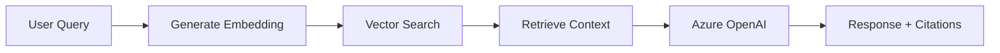

# Pranav AI - RAG Chatbot API

A FastAPI-based chatbot backend that uses **Retrieval Augmented Generation (RAG)** to answer questions about Pranav's portfolio using Azure OpenAI and PostgreSQL with pgvector for semantic search.

## Overview

Pranav AI is a context-aware chatbot that:

- **Ingests documents** (PDF, TXT, MD) about Pranav's work, skills, and projects
- **Generates embeddings** using local sentence-transformers models
- **Performs semantic search** using PostgreSQL pgvector for fast vector similarity
- **Retrieves relevant context** from stored documents
- **Generates responses** using Azure OpenAI GPT-4.1 with retrieved context
- **Provides source citations** for transparency

## Tech Stack

<CardGroup cols={2}>
  <Card title="Framework" icon="code">
    FastAPI with async/await support
  </Card>
  <Card title="AI Model" icon="brain">
    Azure OpenAI GPT-4.1
  </Card>
  <Card title="Embeddings" icon="vector-square">
    sentence-transformers (all-MiniLM-L6-v2)
  </Card>
  <Card title="Database" icon="database">
    PostgreSQL with pgvector extension
  </Card>
</CardGroup>

### Key Technologies

- **FastAPI**: Modern, fast web framework for building APIs
- **Azure OpenAI**: GPT-4.1 for natural language generation
- **sentence-transformers**: Local, free embedding generation (all-MiniLM-L6-v2 model)
- **PostgreSQL + pgvector**: Vector database for semantic similarity search
- **SQLAlchemy**: Async ORM for database operations
- **uv**: Fast Python package manager

## Architecture

The system follows a classic RAG (Retrieval Augmented Generation) pattern:



### Document Processing Flow

1. **Upload**: Documents (PDF/TXT/MD) uploaded via `/admin/documents`
2. **Extract**: Text extracted using pypdf or plain text decoder
3. **Chunk**: Text split into 1000-character chunks with 200-character overlap
4. **Embed**: Each chunk embedded using all-MiniLM-L6-v2 (384 dimensions)
5. **Store**: Chunks and embeddings stored in PostgreSQL with pgvector

### Chat Flow

1. **Query**: User sends message to `/chat`
2. **Embed Query**: Generate embedding for user's question
3. **Search**: Find top 5 similar chunks using cosine similarity
4. **Filter**: Only include chunks with similarity > 0.3
5. **Build Context**: Combine retrieved chunks with source attribution
6. **Generate**: Send to Azure OpenAI with context and system prompt
7. **Respond**: Return answer with source citations

## Use Cases

<AccordionGroup>
  <Accordion title="Portfolio Assistant">
    Answer questions about Pranav's skills, experience, and projects based on uploaded resumes, portfolios, and project documentation.
  </Accordion>
  
  <Accordion title="Document Q&A">
    Enable semantic search and question-answering over any collection of documents with automatic source attribution.
  </Accordion>
  
  <Accordion title="Knowledge Base">
    Build a knowledge base that can answer questions intelligently by combining information from multiple documents.
  </Accordion>
  
  <Accordion title="Context-Aware Chat">
    Maintain conversation history while providing fact-based answers grounded in uploaded documents.
  </Accordion>
</AccordionGroup>

## Features

- **Multi-format Support**: PDF, TXT, and Markdown documents
- **Local Embeddings**: Free, fast sentence-transformers (no API costs)
- **Vector Search**: Fast semantic search with pgvector cosine similarity
- **Source Attribution**: Every response includes source document citations
- **Conversation History**: Maintains chat context for follow-up questions
- **Async Operations**: Non-blocking I/O for high performance
- **Auto Chunking**: Smart text splitting at paragraph/sentence boundaries

## API Endpoints

### Chat

- `POST /chat` - Send a message and get a RAG-powered response

### Admin (Document Management)

- `POST /admin/documents` - Upload and process documents
- `GET /admin/documents` - List all documents with chunk counts
- `GET /admin/documents/{id}` - Get specific document details
- `DELETE /admin/documents/{id}` - Delete document and all chunks

### Health

- `GET /` - Root endpoint with API info
- `GET /health` - Health check endpoint

## Quick Start

```bash
# Install dependencies
uv sync

# Configure .env file
echo "AZURE_OPENAI_ENDPOINT=your-endpoint" >> .env
echo "AZURE_OPENAI_API_KEY=your-key" >> .env
echo "DATABASE_URL=postgresql://..." >> .env

# Run the server
uv run uvicorn main:app --reload --port 8000
```

See the [Setup Guide](/api/setup) for detailed installation instructions.
