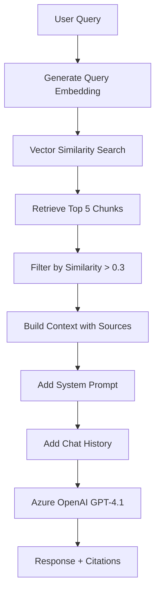

# RAG System

Understand how the Retrieval Augmented Generation (RAG) system works in Pranav AI.

## What is RAG?

RAG (Retrieval Augmented Generation) is a technique that enhances LLM responses by:

1. **Retrieving** relevant information from a knowledge base
2. **Augmenting** the prompt with retrieved context
3. **Generating** a response using the LLM with this context

### Benefits

<CardGroup cols={2}>
  <Card title="Factual Accuracy" icon="check-circle">
    Grounds responses in actual documents, reducing hallucinations
  </Card>
  <Card title="Source Attribution" icon="quote-left">
    Provides citations showing where information came from
  </Card>
  <Card title="Dynamic Knowledge" icon="refresh">
    Update knowledge base without retraining the model
  </Card>
  <Card title="Cost-Effective" icon="dollar-sign">
    No need for expensive model fine-tuning
  </Card>
</CardGroup>

## RAG Pipeline

The complete RAG pipeline in Pranav AI:



## Implementation Details

### 1. Query Embedding

From `src/routes/chat.py:53`:

```python
# Generate embedding for the query
query_embedding = generate_embedding(request.message)
# Uses sentence-transformers all-MiniLM-L6-v2
# Returns 384-dimensional vector
```

The query is converted to a vector in the same embedding space as the document chunks.

**Example**:
```python
query = "What are Pranav's skills?"
embedding = [0.123, -0.456, 0.789, ...]  # 384 dimensions
```

### 2. Vector Similarity Search

From `src/routes/chat.py:60`:

```python
similarity_query = text(f"""
    SELECT 
        c.id,
        c.document_id,
        c.content,
        d.filename,
        1 - (c.embedding <=> '{embedding_str}'::vector) as similarity
    FROM chunks c
    JOIN documents d ON c.document_id = d.id
    ORDER BY c.embedding <=> '{embedding_str}'::vector
    LIMIT 5
""")

result = await db.execute(similarity_query)
rows = result.fetchall()
```

#### How It Works

**pgvector cosine similarity**:
- `<=>` operator calculates cosine distance
- `1 - distance` converts to similarity (0-1 range)
- `ORDER BY distance` finds nearest neighbors
- `LIMIT 5` retrieves top 5 matches

**SQL Breakdown**:

```sql
-- Calculate similarity
1 - (c.embedding <=> '[0.1,0.2,...]'::vector) as similarity

-- This computes:
-- similarity = 1 - cosine_distance
-- where cosine_distance = 1 - (A·B)/(|A||B|)
```

**Example Results**:

| chunk_id | filename | content | similarity |
|----------|----------|---------|------------|
| uuid-1 | resume.pdf | "Python, FastAPI, Django..." | 0.892 |
| uuid-2 | projects.md | "Built RAG chatbot using..." | 0.847 |
| uuid-3 | skills.txt | "Backend development..." | 0.734 |
| uuid-4 | resume.pdf | "Database: PostgreSQL..." | 0.512 |
| uuid-5 | bio.md | "Pranav is a software..." | 0.301 |

### 3. Context Filtering

From `src/routes/chat.py:86`:

```python
context_parts = []
sources = []

for row in rows:
    chunk_id, doc_id, content, filename, similarity = row
    
    # Only include chunks with reasonable similarity
    if similarity > 0.3:
        context_parts.append(f"[From: {filename}]\n{content}")
        sources.append(SourceChunk(
            document_id=doc_id,
            document_name=filename,
            content=content[:200] + "..." if len(content) > 200 else content,
            similarity=round(similarity, 3)
        ))
```

**Why filter at 0.3?**

- **Above 0.7**: Highly relevant
- **0.3 - 0.7**: Potentially relevant
- **Below 0.3**: Likely irrelevant noise

The threshold of 0.3 balances:
- Including enough context
- Avoiding irrelevant information

**Example filtered context**:

```
[From: resume.pdf]
Programming Languages: Python (FastAPI, Django), Go (Gin, Echo), 
JavaScript/TypeScript. Proficient in backend development...

---

[From: projects.md]
Built a RAG chatbot using Azure OpenAI and pgvector for semantic search.
Implemented document chunking and embedding generation...
```

### 4. Context Assembly

From `src/routes/chat.py:105`:

```python
context = "\n\n---\n\n".join(context_parts)
```

Chunks are joined with a separator (`---`) to:
- Clearly delineate different sources
- Help the LLM distinguish between documents
- Maintain readability

**Example assembled context**:

```
[From: resume.pdf]
Programming Languages: Python (FastAPI, Django), Go...

---

[From: projects.md]
Built a RAG chatbot using Azure OpenAI...

---

[From: skills.txt]
Backend Development: 5 years experience...
```

### 5. Prompt Construction

From `src/llm.py:56`:

```python
messages = [
    {"role": "system", "content": SYSTEM_PROMPT.format(context=context)}
]

# Add chat history (last 5 messages)
if chat_history:
    for msg in chat_history[-5:]:
        messages.append(msg)

# Add current query
messages.append({"role": "user", "content": query})
```

**Message Structure**:

```json
[
  {
    "role": "system",
    "content": "You are Pranav AI...\n\n**Context:**\n[From: resume.pdf]\n..."
  },
  {
    "role": "user",
    "content": "What is your experience with Python?"
  },
  {
    "role": "assistant",
    "content": "I have 5 years of experience..."
  },
  {
    "role": "user",
    "content": "What frameworks do you use?"
  }
]
```

### 6. LLM Generation

From `src/llm.py:68`:

```python
response = await client.chat.completions.create(
    model=settings.azure_deployment_name,  # gpt-4.1
    messages=messages,
    temperature=0.7,
    max_tokens=1000,
)

return response.choices[0].message.content
```

**Parameters**:

<ParamField path="model" type="string">
  Azure deployment name (e.g., "gpt-4.1")
</ParamField>

<ParamField path="messages" type="array">
  Conversation history with system prompt and context
</ParamField>

<ParamField path="temperature" type="float" default="0.7">
  Controls randomness:
  - **0.0**: Deterministic, factual
  - **0.7**: Balanced (used here)
  - **1.0**: Creative, varied
</ParamField>

<ParamField path="max_tokens" type="integer" default="1000">
  Maximum response length (roughly 750 words)
</ParamField>

## System Prompt

From `src/llm.py:22`:

```python
SYSTEM_PROMPT = """You are Pranav AI, a helpful assistant that answers 
questions about Pranav based on the provided context.

**Rules:**
- Answer questions based ONLY on the provided context
- If the context doesn't contain relevant information, say "I don't have 
  information about that in my knowledge base"
- Be concise and direct in your responses
- Use a friendly, professional tone
- When information comes from different documents (indicated by [From: filename]), 
  clearly distinguish and attribute information to each source
- For example, if asked about skills and there are multiple resumes, say 
  "According to backend_dev.pdf, Pranav knows X, Y, Z. According to 
  flutter_dev.pdf, Pranav knows A, B, C."
- Always mention which document the information came from when relevant

**Context:**
{context}
"""
```

### Key Design Choices

<AccordionGroup>
  <Accordion title="Instruction to stay grounded">
    ```
    Answer questions based ONLY on the provided context
    ```
    
    Prevents hallucination by forcing the model to use only retrieved information.
  </Accordion>
  
  <Accordion title="Handling unknowns">
    ```
    If the context doesn't contain relevant information, say "I don't have 
    information about that in my knowledge base"
    ```
    
    Honest admission when information is unavailable instead of making things up.
  </Accordion>
  
  <Accordion title="Source attribution">
    ```
    Always mention which document the information came from when relevant
    ```
    
    Encourages citing sources for transparency and verification.
  </Accordion>
  
  <Accordion title="Multi-document handling">
    ```
    When information comes from different documents, clearly distinguish and 
    attribute information to each source
    ```
    
    Handles cases where the same query matches multiple documents.
  </Accordion>
</AccordionGroup>

## Conversation History

From `src/routes/chat.py:108`:

```python
# Convert chat history to LLM format
chat_history = None
if request.chat_history:
    chat_history = [
        {"role": msg.role, "content": msg.content}
        for msg in request.chat_history
    ]
```

From `src/llm.py:61`:

```python
if chat_history:
    for msg in chat_history[-5:]:
        messages.append(msg)
```

**Why last 5 messages?**

- **Token limits**: Avoid exceeding context window
- **Relevance**: Recent messages most relevant
- **Performance**: Faster processing

**Example with history**:

```json
{
  "message": "What frameworks?",
  "chat_history": [
    {"role": "user", "content": "What languages do you know?"},
    {"role": "assistant", "content": "Python, Go, JavaScript"}
  ]
}
```

The LLM understands "What frameworks?" refers to frameworks for those languages.

## Response Structure

From `src/routes/chat.py:34`:

```python
class ChatResponse(BaseModel):
    response: str
    sources: List[SourceChunk]

class SourceChunk(BaseModel):
    document_id: UUID
    document_name: str
    content: str
    similarity: float
```

**Example response**:

```json
{
  "response": "According to backend_dev.pdf, Pranav is proficient in Python (FastAPI, Django), Go (Gin, Echo), and JavaScript/TypeScript. He has 5 years of backend development experience.",
  "sources": [
    {
      "document_id": "a1b2c3d4-e5f6-7890-abcd-ef1234567890",
      "document_name": "backend_dev.pdf",
      "content": "Programming Languages: Python (FastAPI, Django), Go (Gin, Echo), JavaScript/TypeScript. Proficient in backend development with 5 years of experience...",
      "similarity": 0.892
    }
  ]
}
```

## Edge Cases

### No Documents in Database

From `src/routes/chat.py:76`:

```python
if not rows:
    return ChatResponse(
        response="I don't have any documents in my knowledge base yet. Please upload some documents first.",
        sources=[]
    )
```

### No Relevant Chunks

From `src/routes/chat.py:99`:

```python
if not context_parts:
    return ChatResponse(
        response="I couldn't find relevant information to answer your question in my knowledge base.",
        sources=[]
    )
```

### Empty Message

From `src/routes/chat.py:49`:

```python
if not request.message.strip():
    raise HTTPException(status_code=400, detail="Message cannot be empty")
```

## Performance Optimization

### Embedding Generation

```python
# Fast: Local sentence-transformers
embedding = generate_embedding(query)  # ~10-50ms

# vs. API-based (OpenAI embeddings)
# Would add network latency: ~100-500ms
```

### Vector Search

```python
# With pgvector index
CREATE INDEX ON chunks USING ivfflat (embedding vector_cosine_ops);

# Search time:
# - Without index: O(n) - ~100ms for 10k chunks
# - With index: O(log n) - ~5-20ms for 10k chunks
```

### Batch Operations

```python
# Good: Retrieve top 5 in single query
LIMIT 5

# Bad: Multiple individual queries
# for similarity in similarities:
#     query = "SELECT ... WHERE similarity = ?"
```

## Quality Tuning

### Chunk Size

```python
chunk_size = 1000  # characters
chunk_overlap = 200  # characters
```

**Tradeoffs**:

| Chunk Size | Pros | Cons |
|------------|------|------|
| Small (500) | Precise retrieval | May miss context |
| Medium (1000) | Balanced | Default choice |
| Large (2000) | More context | Less precise |

### Similarity Threshold

```python
if similarity > 0.3:  # Current threshold
```

**Tuning**:

| Threshold | Effect |
|-----------|--------|
| 0.2 | More results, more noise |
| 0.3 | Balanced (current) |
| 0.5 | Fewer results, higher quality |
| 0.7 | Very strict, may miss relevant info |

### Number of Results

```python
LIMIT 5  # Top 5 chunks
```

**Considerations**:

- **More chunks**: Better coverage, but longer prompts
- **Fewer chunks**: Faster, but may miss information
- **Current (5)**: Good balance for most use cases

### Temperature

```python
temperature=0.7  # Balanced creativity
```

**Tuning**:

| Temperature | Use Case |
|-------------|----------|
| 0.0 - 0.3 | Factual, deterministic |
| 0.5 - 0.8 | Balanced (current) |
| 0.9 - 1.0 | Creative, varied |

## Evaluation Metrics

To measure RAG system quality:

### Retrieval Metrics

- **Precision**: % of retrieved chunks that are relevant
- **Recall**: % of relevant chunks that are retrieved
- **MRR** (Mean Reciprocal Rank): Position of first relevant result

### Generation Metrics

- **Faithfulness**: Does response match retrieved context?
- **Answer Relevance**: Does response answer the query?
- **Context Utilization**: Is retrieved context actually used?

### User Metrics

- **Response Time**: End-to-end latency
- **User Satisfaction**: Thumbs up/down feedback
- **Source Click Rate**: Do users verify sources?

## Advanced Techniques

<AccordionGroup>
  <Accordion title="Query Expansion">
    Expand user query with synonyms or related terms:
    
    ```python
    query = "What programming languages?"
    expanded = [
        "programming languages",
        "coding languages",
        "tech stack",
        "frameworks"
    ]
    
    # Search with multiple embeddings
    results = []
    for q in expanded:
        embedding = generate_embedding(q)
        results.extend(vector_search(embedding))
    
    # Deduplicate and rank
    ```
  </Accordion>
  
  <Accordion title="Reranking">
    Use a reranker model to improve result quality:
    
    ```python
    from sentence_transformers import CrossEncoder
    
    reranker = CrossEncoder('cross-encoder/ms-marco-MiniLM-L-6-v2')
    
    # Get top 20 results
    candidates = vector_search(query_embedding, limit=20)
    
    # Rerank with cross-encoder
    scores = reranker.predict([
        (query, chunk.content) for chunk in candidates
    ])
    
    # Return top 5 after reranking
    top_5 = sorted(zip(candidates, scores), key=lambda x: x[1])[:5]
    ```
  </Accordion>
  
  <Accordion title="Hybrid Search">
    Combine vector search with keyword search:
    
    ```python
    # Vector search (semantic)
    vector_results = vector_search(embedding)
    
    # Keyword search (exact match)
    keyword_results = db.query(
        Chunk
    ).filter(
        Chunk.content.ilike(f"%{query}%")
    ).all()
    
    # Combine with weighted scores
    results = merge_results(
        vector_results, 
        keyword_results, 
        weights=[0.7, 0.3]
    )
    ```
  </Accordion>
  
  <Accordion title="Chunk Metadata">
    Store and use metadata for filtering:
    
    ```python
    # Add metadata column
    chunk.metadata = {
        "section": "Skills",
        "date": "2024-01-15",
        "author": "Pranav"
    }
    
    # Filter by metadata
    results = vector_search(
        embedding,
        filters={"section": "Skills"}
    )
    ```
  </Accordion>
</AccordionGroup>

## Limitations

<Warning>
  Current limitations to be aware of:
</Warning>

1. **Context Window**: Limited to 5 chunks, may miss information
2. **Chunk Boundaries**: May split related information
3. **No Multi-hop**: Can't combine information across multiple queries
4. **Static Threshold**: 0.3 similarity may not work for all queries
5. **No Verification**: Doesn't verify LLM actually used the context

## Next Steps

<CardGroup cols={2}>
  <Card title="Embeddings" icon="vector-square" href="/api/embeddings">
    Learn about embedding generation
  </Card>
  <Card title="Architecture" icon="diagram-project" href="/api/architecture">
    See how everything fits together
  </Card>
  <Card title="Chat API" icon="messages" href="/api/chat">
    Use the chat endpoint
  </Card>
</CardGroup>
