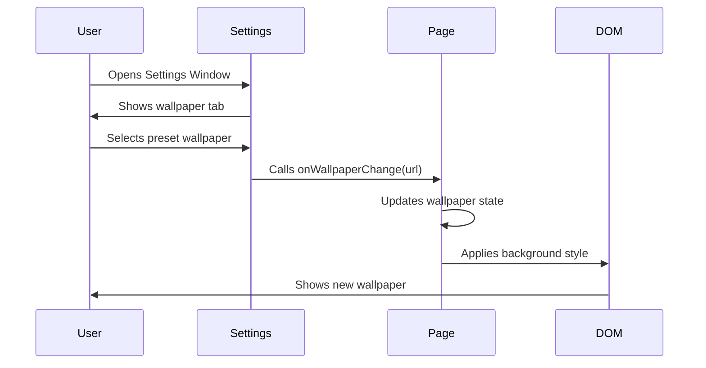

# Wallpaper Customization

The portfolio includes a complete wallpaper system that allows users to customize the desktop background with preset wallpapers or upload their own images.

## Overview

Wallpaper customization is managed through the Settings window and controlled at the app level in `app/page.tsx`.

## How It Works

### State Management

The wallpaper state is managed in the main page component:

```tsx
// From app/page.tsx:19-26
export default function Home() {
  const [wallpaper, setWallpaper] = useState<string | null>(null);
  
  const handleWallpaperChange = (newWallpaper: string) => {
    console.log('New wallpaper:', newWallpaper);
    setWallpaper(newWallpaper);
  };
  
  // ...
}
```

### Background Styling

The wallpaper is applied using inline styles:

```tsx
// From app/page.tsx:28-42
const backgroundStyle = wallpaper
  ? {
      backgroundImage: `url(${wallpaper})`,
      backgroundSize: 'cover',
      backgroundPosition: 'center',
      backgroundRepeat: 'no-repeat',
    }
  : {};

return (
  <div
    className="relative h-screen w-full dark:bg-black bg-white dark:bg-dot-white/[0.2] bg-dot-black/[0.2]"
    style={backgroundStyle}
  >
    {/* App content */}
  </div>
);
```

<Info>
  When no wallpaper is selected, the default background shows a dotted pattern via Tailwind classes.
</Info>

### Prop Drilling

The wallpaper change handler is passed down to components that need it:

```tsx
// Pass to DesktopIcons
<DesktopIcons onWallpaperChange={handleWallpaperChange} />

// Pass to FloatingDock
<FloatingDockDemo onWallpaperChange={handleWallpaperChange} />

// Opens SettingsWindow with wallpaper handler
<SettingsWindow
  onClose={() => setShowSettings(false)}
  onWallpaperChange={onWallpaperChange}
/>
```

## Settings Window

The wallpaper customization UI is in the Settings window (`app/components/windows/SettingsWindow.tsx`).

### Wallpaper Tab

The Settings window has multiple tabs, with wallpaper being the default:

```tsx
// From SettingsWindow.tsx:25-32
type SettingsTab = 'wallpaper' | 'appearance' | 'sound' | 'theme';

const settingsTabs = [
  { id: 'wallpaper', label: 'Wallpaper', icon: <IconWallpaper size={20} /> },
  { id: 'appearance', label: 'Appearance', icon: <IconPalette size={20} /> },
  { id: 'sound', label: 'Sound', icon: <IconVolume size={20} /> },
  { id: 'theme', label: 'Theme', icon: <IconBrush size={20} /> },
];
```

## Preset Wallpapers

The app includes 5 preset wallpapers:

```tsx
// From SettingsWindow.tsx:41-73
const presetWallpapers: PresetWallpaper[] = [
  {
    id: 1,
    name: 'Iced Mountains',
    url: '/wallpapers/matrix2.jpg',
    thumbnail: '/wallpapers/matrix2.jpg',
  },
  {
    id: 2,
    name: 'Nature',
    url: '/wallpapers/matrix.jpg',
    thumbnail: '/wallpapers/matrix.jpg',
  },
  {
    id: 3,
    name: 'Spring',
    url: '/wallpapers/matrix4.jpg',
    thumbnail: '/wallpapers/matrix4.jpg',
  },
  {
    id: 4,
    name: 'Mountains',
    url: '/wallpapers/matrix3.jpg',
    thumbnail: '/wallpapers/matrix3.jpg',
  },
  {
    id: 5,
    name: 'anime',
    url: '/wallpapers/matrix5.png',
    thumbnail: '/wallpapers/matrix5.png',
  },
];
```

### Wallpaper Card Component

Each preset is rendered with an optimized card component:

```tsx
// From SettingsWindow.tsx:75-107
const WallpaperCard = memo(function WallpaperCard({
  wp,
  selected,
  onSelect,
}: {
  wp: PresetWallpaper;
  selected: boolean;
  onSelect: (wp: PresetWallpaper) => void;
}) {
  return (
    <div
      onClick={() => onSelect(wp)}
      className={`relative rounded-lg overflow-hidden cursor-pointer border-2 hover:opacity-90 ${
        selected ? 'border-blue-500' : 'border-transparent hover:border-white/30'
      }`}
    >
      <Image
        src={wp.thumbnail}
        alt={wp.name}
        width={320}
        height={128}
        className="w-full h-32 object-cover"
        sizes="(max-width: 768px) 50vw, 320px"
        priority={false}
        loading="lazy"
        decoding="async"
      />
      <div className="absolute bottom-0 left-0 right-0 bg-black/50 backdrop-blur-sm p-2">
        <p className="text-white/90 text-sm text-center">{wp.name}</p>
      </div>
    </div>
  );
});
```

<Note>
  The component uses `React.memo` to prevent unnecessary re-renders when other wallpapers are selected.
</Note>

### Preset Selection

Selecting a preset wallpaper:

```tsx
// From SettingsWindow.tsx:133-139
const handlePresetSelect = useCallback(
  (wallpaper: (typeof presetWallpapers)[0]) => {
    setSelectedWallpaper(wallpaper.url);
    onWallpaperChange?.(wallpaper.url);
  },
  [onWallpaperChange]
);
```

### Grid Layout

```tsx
// From SettingsWindow.tsx:176-188
<div>
  <h3 className="text-white/90 font-medium mb-4">Preset Wallpapers</h3>
  <div className="grid grid-cols-2 gap-4">
    {presetWallpapers.map(wp => (
      <WallpaperCard
        key={wp.id}
        wp={wp}
        selected={selectedWallpaper === wp.url}
        onSelect={handlePresetSelect}
      />
    ))}
  </div>
</div>
```

## Custom Wallpaper Upload

Users can upload their own images:

### Upload UI

```tsx
// From SettingsWindow.tsx:161-173
<div className="mb-8">
  <h3 className="text-white/90 font-medium mb-4">Upload Custom Wallpaper</h3>
  <label className="flex items-center gap-3 p-4 border border-dashed border-white/20 rounded-lg cursor-pointer hover:bg-white/5">
    <IconUpload className="text-white/60" />
    <span className="text-white/60">Choose a file or drag it here</span>
    <input
      type="file"
      accept="image/*"
      onChange={handleFileUpload}
      className="hidden"
    />
  </label>
</div>
```

### File Upload Handler

Converts the uploaded image to a data URL:

```tsx
// From SettingsWindow.tsx:117-131
const handleFileUpload = useCallback(
  (event: React.ChangeEvent<HTMLInputElement>) => {
    const file = event.target.files?.[0];
    if (file) {
      const reader = new FileReader();
      reader.onloadend = () => {
        const result = reader.result as string;
        setSelectedWallpaper(result);
        onWallpaperChange?.(result);
      };
      reader.readAsDataURL(file);
    }
  },
  [onWallpaperChange]
);
```

<Tabs>
  <Tab title="How It Works">
    1. User selects an image file
    2. `FileReader` converts it to base64 data URL
    3. Data URL is stored in state
    4. Background updates via `onWallpaperChange`
    5. Image persists for the session
  </Tab>
  
  <Tab title="Supported Formats">
    The file input accepts all image formats:
    ```tsx
    accept="image/*"
    ```
    
    Common formats:
    - JPEG/JPG
    - PNG
    - WebP
    - GIF
    - SVG
  </Tab>
  
  <Tab title="Limitations">
    <Warning>
      - Uploaded wallpapers are **not persisted** across page reloads
      - Large images may impact performance
      - No file size validation (browser-dependent)
    </Warning>
  </Tab>
</Tabs>

## Settings Window Layout

The Settings window uses a responsive sidebar layout:

<Tabs>
  <Tab title="Desktop">
    **Desktop Layout (> 768px)**
    
    Side-by-side navigation and content:
    
    ```tsx
    <div className="flex-1 flex flex-col md:flex-row overflow-hidden">
      {/* Desktop Sidebar */}
      <div className="hidden md:block w-64 border-r border-white/10 bg-black/20">
        <nav className="p-4">
          {settingsTabs.map(tab => (
            <motion.button
              key={tab.id}
              whileHover={{ x: 4 }}
              onClick={() => setActiveTab(tab.id)}
              className={activeTab === tab.id ? 'bg-blue-500/20' : 'hover:bg-white/5'}
            >
              {tab.icon}
              {tab.label}
            </motion.button>
          ))}
        </nav>
      </div>
      
      {/* Content Area */}
      <div className="flex-1 overflow-auto">
        {renderContent()}
      </div>
    </div>
    ```
  </Tab>
  
  <Tab title="Mobile">
    **Mobile Layout (< 768px)**
    
    Horizontal scrolling tabs at top:
    
    ```tsx
    <div className="md:hidden border-b border-white/10 bg-black/20">
      <div className="flex overflow-x-auto mobile-hide-scrollbar">
        {settingsTabs.map(tab => (
          <motion.button
            key={tab.id}
            onClick={() => setActiveTab(tab.id)}
            className={activeTab === tab.id 
              ? 'bg-blue-500/20 text-blue-400 border-b-2 border-blue-400' 
              : 'text-white/60'
            }
          >
            {tab.icon}
            <span className="hidden sm:inline">{tab.label}</span>
          </motion.button>
        ))}
      </div>
    </div>
    ```
  </Tab>
</Tabs>

## Theme Integration

The Settings window also includes theme customization:

```tsx
// From SettingsWindow.tsx:191-270
case 'theme':
  return (
    <div className="p-6">
      <h2 className="text-xl font-semibold mb-6 text-blue-400">Theme Settings</h2>
      
      <div className="grid grid-cols-1 md:grid-cols-2 gap-4">
        {themes.map(theme => (
          <div
            key={theme.id}
            onClick={() => handleThemeSelect(theme.id)}
            className={currentTheme.id === theme.id 
              ? 'border-blue-500 bg-blue-500/10' 
              : 'border-white/10 bg-white/5'
            }
          >
            {/* Theme preview with color swatches */}
            <div className="flex items-center gap-3 mb-3">
              <div className="flex gap-1">
                <div className="w-4 h-4 rounded-full" style={{ backgroundColor: theme.colors.primary }} />
                <div className="w-4 h-4 rounded-full" style={{ backgroundColor: theme.colors.accent }} />
                <div className="w-4 h-4 rounded-full" style={{ backgroundColor: theme.colors.iconGreen }} />
              </div>
            </div>
            
            <div>
              <h3 className="text-white/90 font-medium mb-1">{theme.name}</h3>
              <p className="text-white/60 text-sm">{theme.description}</p>
            </div>
          </div>
        ))}
      </div>
    </div>
  );
```

## Performance Optimizations

### Memoization

Wallpaper cards are memoized to prevent re-renders:

```tsx
const WallpaperCard = memo(function WallpaperCard({ ... }) {
  // Component logic
});
```

### useCallback

Event handlers are wrapped in `useCallback`:

```tsx
const handleFileUpload = useCallback(
  (event: React.ChangeEvent<HTMLInputElement>) => {
    // Handler logic
  },
  [onWallpaperChange]
);

const handlePresetSelect = useCallback(
  (wallpaper) => {
    // Handler logic
  },
  [onWallpaperChange]
);
```

### Lazy Loading

Images use lazy loading:

```tsx
<Image
  src={wp.thumbnail}
  priority={false}
  loading="lazy"
  decoding="async"
/>
```

## Accessing Settings

Users can open Settings through two methods:

<Steps>
  <Step title="Desktop Icons">
    Click the Settings icon on the desktop
  </Step>
  
  <Step title="Floating Dock">
    Click the Settings icon in the bottom dock
  </Step>
</Steps>

## Future Enhancements

Potential improvements to the wallpaper system:

- **localStorage Persistence** - Save selected wallpaper across sessions
- **Wallpaper Gallery** - More preset options
- **Blur/Brightness Controls** - Adjust wallpaper appearance
- **Gradient Overlays** - Add color overlays for better text readability
- **Unsplash Integration** - Fetch wallpapers from Unsplash API
- **File Size Validation** - Limit upload size for performance
- **Image Cropping** - Crop uploaded images before applying

## Example: Complete Wallpaper Flow



## Code Summary

Key files for wallpaper customization:

| File | Purpose |
|------|----------|
| `app/page.tsx` | Main wallpaper state management |
| `app/components/windows/SettingsWindow.tsx` | Wallpaper selection UI |
| `app/components/ui/DesktopIcons.tsx` | Passes wallpaper handler to Settings |
| `app/components/Navbar.tsx` | Dock integration with Settings |
| `public/wallpapers/` | Preset wallpaper images |

## Next Steps

<CardGroup cols={2}>
  <Card title="Desktop Mode" icon="desktop" href="/features/desktop-mode">
    Return to desktop and see your new wallpaper
  </Card>
  
  <Card title="Window System" icon="window-maximize" href="/features/window-system">
    Learn about the Settings window features
  </Card>
</CardGroup>